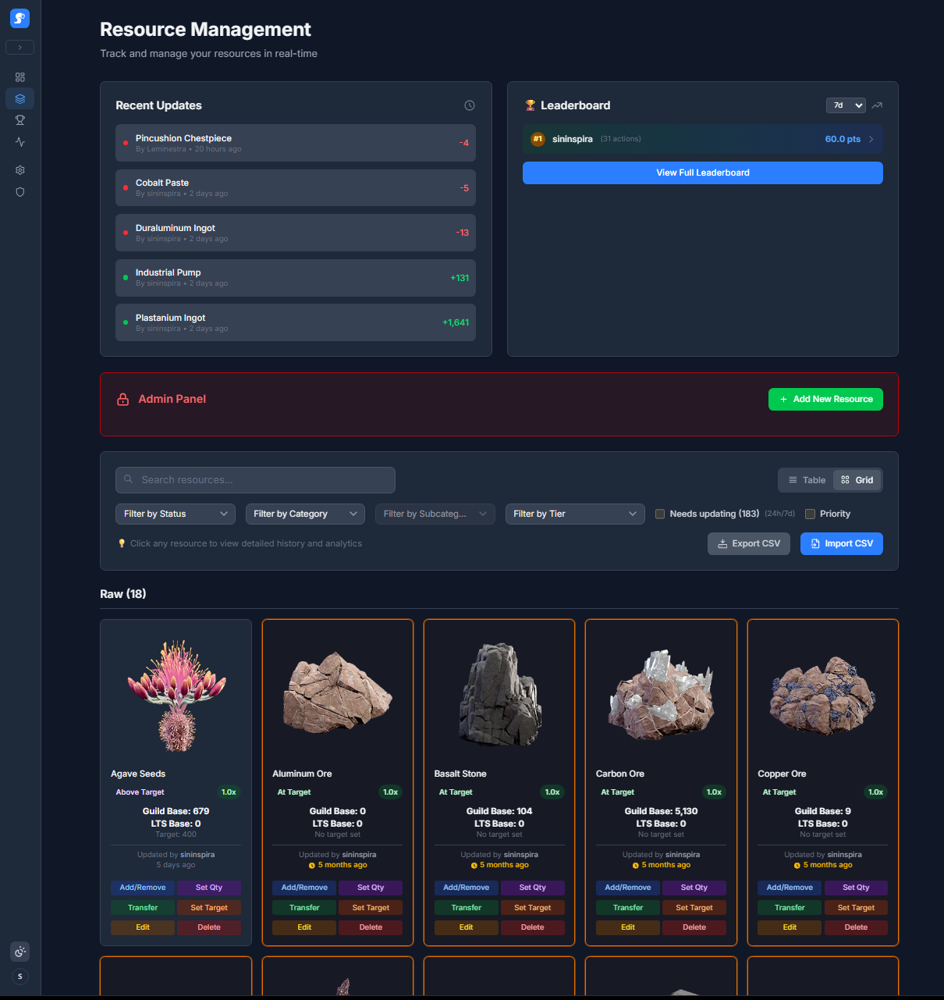

# 🚨⚠️Users Moving from the old tracker, and those updating from 3.x to 4.x - please refer to the [Database Migration Guide](./DB_MIGRATION.md).⚠️🚨

# Resource Tracker

A comprehensive resource management and tracking portal with Discord authentication and role-based access control. Perfect for gaming communities, organizations, and teams that need to track shared resources, inventory, or assets.

Made for Dune: Awakening. Originally forked from https://github.com/theyetty and adapted to the specific needs of my guild.

Removed from fork network due to original author repository being deleted, and database/backend changes incompatible with other forks.

## 🚀 Release Notes - Version 4.0.2

**Release Date:** September 3, 2025

---

### ✨ New Features

* **Modal Overhaul and Icon Consistency:** The `What's New` modal has been completely overhauled to better handle long content, including a new "See More" feature. This update also replaces hardcoded SVGs with consistent `lucide-react` icons for the delete confirmation modal across the application.

### 🚀 Improvements

* **Modal Accessibility:** All modals now have improved accessibility with added ARIA attributes, and users can close them by clicking the overlay without accidentally closing them by clicking inside the modal content.
* **Code Maintainability:** The colors for the activity chart on the resource detail page have been refactored from hardcoded strings into a reusable `CHART_COLORS` constant, making the component easier to maintain.

### 🐛 Bug Fixes

* **Squished Legend Circles:** Fixed an issue where the activity timeline legend circles would get squished on narrower viewports.
* **Invisible Progress Bar:** The progress bar on the resource details page now correctly appears at 0%, fixing a bug where it would disappear when the quantity was zero.
* **WhatsNewModal Close Behavior:** The `What's New` modal's 'X' button and backdrop click now correctly dismiss the modal permanently, aligning with the behavior of the "Got It!" button.
## 🚀 Release Notes - Version 4.0.0

**Release Date:** September 2, 2025

---

### ✨ New Feature

* **Priority Resource Flag:** Resources now have an `isPriority` boolean flag. This update includes adding a new column to the database, a checkbox in the **EditResourceModal** to set the status, and a visual indicator (an asterisk) in both the table and grid views. Additionally, a filter has been implemented to display only priority resources, and the API has been updated to support this new feature.


*See lib/changelog.json for previous update history*

----------------------------------------------------------------------------------------




## Features

- **Discord OAuth Authentication** - Secure login with Discord
- **Role-Based Access Control** - Permissions managed through Discord server roles
- **Resource Management** - Track quantities, categories, and changes with visual status indicators
- **Activity Logging** - Complete audit trail of all user actions with time filtering
- **GDPR Compliance** - Data export and deletion tools for privacy compliance
- **Grid & Table Views** - Multiple ways to view and manage resources
- **Real-Time Updates** - Live status changes and animations
- **Interactive Charts** - Resource history visualization with hover details
- **Admin Controls** - Target quantity management for authorized roles
- **Responsive Design** - Modern UI optimized for all devices

## GDPR & Privacy Features

- **Data Export** - Users can download all their data in JSON format
- **Data Deletion** - Request anonymization of personal data
- **Activity Transparency** - View complete history of actions taken
- **Privacy Controls** - Clear data retention policies and user rights

## 🆓 Deploy for Free (Recommended)

### Step 1: Fork the Repository
1. Click the "Fork" button at the top of this GitHub repository
2. Clone your fork to your local machine:
```bash
git clone https://github.com/YOUR_USERNAME/ResourceTracker.git
cd ResourceTracker
```

### Step 2: Set up Discord OAuth Application
1. Go to https://discord.com/developers/applications
2. Click "New Application" and give it a name
3. Go to **OAuth2 → General**:
   - Copy the **Client ID** and **Client Secret** (save these for later)
4. Go to **OAuth2 → Redirects**:
   - Add redirect URI: `https://your-app-name.vercel.app/api/auth/callback/discord`
   - Replace `your-app-name` with your planned Vercel app name
5. Go to **Bot** (optional, for advanced Discord integration)

### Step 3: Get Discord Server Details
1. Enable Developer Mode in Discord (User Settings → Advanced → Developer Mode)
2. Right-click your Discord server → "Copy Server ID" (this is your `DISCORD_GUILD_ID`)
3. Right-click on roles you want to use → "Copy ID" (for `DISCORD_ROLES_CONFIG`)

### Step 4: Create Free Turso Database
1. Go to https://turso.tech and sign up (free tier: 500 databases, 1B row reads/month)
2. Click "Create Database"
3. Choose a database name (e.g., `resource-tracker-db`)
4. Select the closest region to your users
5. After creation, click on your database
6. Copy the **Database URL** (starts with `libsql://`)
7. Click "Create Token" and copy the **Auth Token**

### Step 5: Deploy to Vercel
1. Go to https://vercel.com and sign up with your GitHub account
2. Click "New Project" and import your forked repository
3. In the deployment settings, add these **Environment Variables**:

```bash
# Discord OAuth (from Step 2)
DISCORD_CLIENT_ID=your_discord_client_id
DISCORD_CLIENT_SECRET=your_discord_client_secret
DISCORD_GUILD_ID=your_discord_server_id

# Discord Roles (single line JSON - see ENVIRONMENT.md for details)
DISCORD_ROLES_CONFIG=[{"id":"your_role_id","name":"Admin","level":100,"isAdmin":true,"canAccessResources":true}]

# NextAuth (generate with: openssl rand -base64 32)
NEXTAUTH_URL=https://your-app-name.vercel.app
NEXTAUTH_SECRET=your_long_random_secret_here

# Turso Database (from Step 4)
TURSO_DATABASE_URL=libsql://your-database.turso.io
TURSO_AUTH_TOKEN=your_turso_auth_token

# Optional: Customize branding
NEXT_PUBLIC_ORG_NAME=Your Community Name
```

4. Click **Deploy**

***Vercel Project Settings Note: Under "Settings" -> "Build and Deployment", make sure "Node.js Version" is set to "22.x". Redeploy the production build if necessary.***

### Step 6: Initialize Database Schema
After deployment, you need to set up your database tables:

1. Install Drizzle CLI locally:
```bash
npm install -g drizzle-kit
```

2. Clone your repository and install dependencies:
```bash
git clone https://github.com/YOUR_USERNAME/ResourceTracker.git
cd ResourceTracker
npm install
```

3. Create a `.env.local` file with your Turso credentials:
```bash
TURSO_DATABASE_URL=your_turso_database_url
TURSO_AUTH_TOKEN=your_turso_auth_token
```

4. Run the database migration:
```bash
npx drizzle-kit push
```

### Step 7: Populate with Sample Data (Optional)
Add some initial resources to test the app:

```bash
npm run populate-resources-safe
```

### Step 8: Update Discord OAuth Redirect
Go back to your Discord application and update the redirect URI to match your deployed Vercel URL:
- `https://your-actual-vercel-url.vercel.app/api/auth/callback/discord`

### 🎉 You're Done!
Your Resource Tracker is now running for free! Visit your Vercel URL and sign in with Discord.

**Free Tier Limits:**
- **Vercel**: 100GB bandwidth, unlimited projects
- **Turso**: 500 databases, 1B row reads, 1M row writes/month
- **Discord**: Unlimited OAuth usage

---

## 🛠️ Local Development Setup

For local development:

1. Install dependencies:
```bash
npm install
```

2. Create a `.env.local` file with the environment variables (see [ENVIRONMENT.md](./ENVIRONMENT.md) for details)

3. Run the database migration:
```bash
npx drizzle-kit push
```

4. Start the development server:
```bash
npm run dev
```

## Customization

This application is designed to be easily customizable for any organization or community:

- **Branding**: Set `NEXT_PUBLIC_ORG_NAME` to customize organization name
- **Roles**: Configure Discord roles via `DISCORD_ROLES_CONFIG` 
- **Resources**: Modify resource categories and types to fit your needs
- **Styling**: Update themes and colors in Tailwind configuration

See [ENVIRONMENT.md](./ENVIRONMENT.md) for all configuration options.

## Tech Stack

- **Frontend**: Next.js 14, React, TypeScript, Tailwind CSS
- **Authentication**: NextAuth.js with Discord provider
- **Database**: Turso (SQLite), Drizzle ORM
- **Deployment**: Vercel-ready
- **Privacy**: GDPR-compliant data handling

## Contributing

We welcome contributions! Please see [CONTRIBUTING.md](./CONTRIBUTING.md) for guidelines on how to contribute to this project.

## License

This project is open source. See [LICENSE](./LICENSE) for more information.

[](https://deepwiki.com/sininspira2/ResourceTracker)
