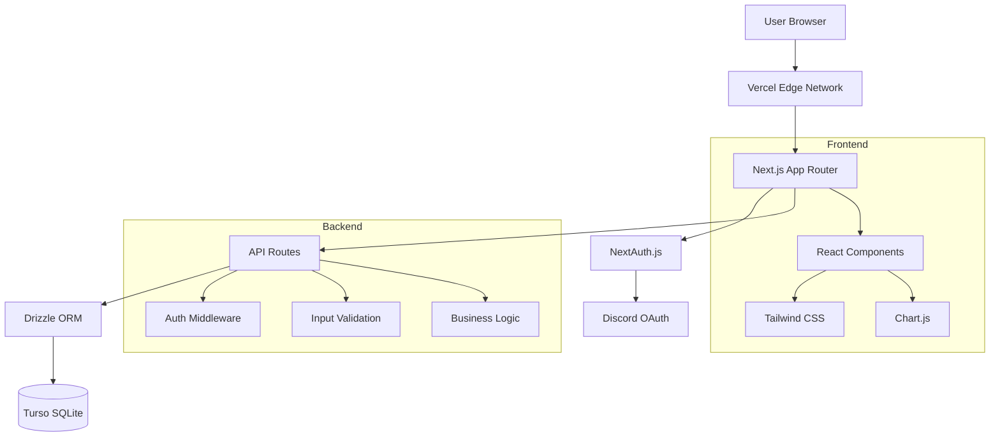

# 🏗️ Architecture Overview

This document provides a high-level overview of Resource Tracker's architecture, technology choices, and design decisions.

## System Architecture



## Technology Stack

### Frontend
- **Framework**: Next.js 14 with App Router
- **UI Library**: React 18 with TypeScript
- **Styling**: Tailwind CSS with dark/light themes
- **Charts**: Chart.js for resource history visualization
- **State Management**: React hooks (no external state library)

### Backend
- **Runtime**: Node.js on Vercel Edge Functions
- **API**: Next.js API Routes with TypeScript
- **Authentication**: NextAuth.js with Discord OAuth
- **Database ORM**: Drizzle ORM with TypeScript
- **Database**: Turso (SQLite) cloud database

### Infrastructure
- **Hosting**: Vercel (Edge Network + Serverless Functions)
- **Database**: Turso (Global SQLite replication)
- **CDN**: Vercel Edge Network (100+ regions)
- **SSL**: Automatic HTTPS with Vercel

## Design Principles

### Security First
- **Authentication Required**: All protected routes require Discord OAuth
- **Role-Based Access**: Granular permissions based on Discord roles
- **Input Validation**: All user inputs validated and sanitized
- **GDPR Compliant**: User data export and deletion capabilities

### Performance Optimized
- **Edge Computing**: API routes run on Vercel Edge Runtime
- **Database Optimization**: Efficient queries with Drizzle ORM
- **Caching Strategy**: Strategic caching for static data
- **Bundle Optimization**: Code splitting and tree shaking

### Developer Experience
- **Type Safety**: Full TypeScript coverage
- **Database Migrations**: Version-controlled schema changes
- **Hot Reloading**: Fast development iteration
- **Error Handling**: Comprehensive error boundaries

### User Experience
- **Responsive Design**: Mobile-first approach
- **Dark/Light Themes**: Automatic theme detection
- **Real-time Updates**: Live status indicators
- **Accessibility**: WCAG compliance considerations

## Data Flow

### Authentication Flow
```
1. User clicks "Sign in with Discord"
2. Redirected to Discord OAuth
3. User authorizes application
4. Discord returns authorization code
5. NextAuth exchanges code for access token
6. Fetch user's Discord guild roles
7. Store session with role information
8. Redirect to dashboard
```

### Resource Update Flow
```
1. User submits resource quantity change
2. Middleware validates authentication
3. API route checks user permissions
4. Validate input data (quantity, type, reason)
5. Calculate status based on target quantity
6. Update resource table
7. Create history entry for audit trail
8. Calculate and record leaderboard points
9. Return updated resource data
10. Frontend updates UI optimistically
```

### Permission System
```
Role Configuration → Discord Roles → Session Storage → Route Protection

DISCORD_ROLES_CONFIG ──→ User's Discord Roles ──→ JWT Token ──→ API Authorization
                                                      ↓
                                              Middleware Check ──→ Allow/Deny
```

## Component Architecture

### Frontend Components
```
app/
├── layout.tsx              # Root layout with providers
├── page.tsx               # Landing page
├── components/            # Reusable components
│   ├── ClientNavigation.tsx   # Navigation with auth
│   ├── ResourceTable.tsx     # Main resource grid
│   ├── ResourceHistoryChart.tsx  # Time series charts
│   └── ThemeProvider.tsx     # Dark/light theme context
├── dashboard/             # Dashboard pages
└── resources/             # Resource management pages
```

### API Layer
```
app/api/
├── auth/[...nextauth]/    # NextAuth.js handler
├── resources/             # Resource CRUD operations
│   ├── route.ts              # List and create resources
│   ├── [id]/route.ts         # Get, update, delete resource
│   ├── [id]/history/         # Resource change history
│   └── [id]/target/          # Target quantity management
├── user/                  # User-specific endpoints
│   ├── activity/route.ts     # User activity history
│   ├── data-export/route.ts  # GDPR data export
│   └── data-deletion/route.ts # GDPR data deletion
└── leaderboard/           # Points and rankings
```

## Database Design

### Schema Overview
```sql
-- Core tables
users              # Discord user information
user_sessions       # Cached role and guild data
resources           # Resource definitions and quantities
resource_history    # Audit trail of all changes
leaderboard         # Points and contribution tracking
```

### Key Relationships
- **Users → Resources**: Through resource_history.updated_by
- **Resources → History**: One-to-many relationship
- **Users → Leaderboard**: Points calculated from history
- **Resources → Status**: Calculated from quantity vs target

### Indexing Strategy
- Primary keys for all tables (nanoid)
- Foreign key indexes for relationships
- Composite indexes for common queries
- Discord ID unique constraint

## Security Architecture

### Authentication Layers
1. **Discord OAuth**: External identity provider
2. **NextAuth Sessions**: Secure JWT tokens
3. **Middleware Protection**: Route-level authorization
4. **API Validation**: Input sanitization and validation

### Data Protection
- **Encryption at Rest**: Turso native encryption
- **Encryption in Transit**: HTTPS/TLS everywhere
- **Token Security**: Secure cookie configuration
- **Role Isolation**: Least privilege access control

## Scalability Considerations

### Horizontal Scaling
- **Stateless Architecture**: No server-side state
- **Edge Distribution**: Global CDN and edge functions
- **Database Replication**: Turso multi-region support
- **Caching Strategy**: Static asset and API response caching

### Performance Monitoring
- **Response Times**: API endpoint performance
- **Database Queries**: Query execution time
- **Error Rates**: 4xx/5xx response monitoring
- **User Metrics**: Page load times and interactions

### Capacity Planning
- **Database Growth**: Resource history accumulation
- **API Load**: Rate limiting and throttling
- **Storage Optimization**: Image and asset management
- **Memory Usage**: Server function memory limits

## Deployment Architecture

### Vercel Integration
```
GitHub Repository ──→ Vercel Build ──→ Edge Deployment
                             ↓
                       Environment Variables ──→ Runtime Configuration
                             ↓
                       Database Connection ──→ Turso Cloud
```

### Environment Strategy
- **Development**: Local with .env.local
- **Preview**: Vercel preview deployments
- **Production**: Vercel production with secure environment variables

### CI/CD Pipeline
1. Code pushed to GitHub
2. Vercel triggers automatic build
3. TypeScript compilation and linting
4. Database schema validation
5. Deployment to edge network
6. Health checks and monitoring

## Extension Points

### Plugin Architecture
The system is designed for extensibility:

```typescript
// Example plugin interface
interface ResourcePlugin {
  beforeUpdate?: (resource: Resource) => Resource
  afterUpdate?: (resource: Resource) => void
  customValidation?: (input: any) => boolean
  pointsCalculation?: (change: ResourceChange) => number
}
```

### Custom Integrations
- **Webhooks**: External system notifications
- **API Extensions**: Custom endpoints for specific needs
- **UI Components**: Replaceable component architecture
- **Theme System**: Customizable styling and branding

### Multi-tenant Support
Architecture supports multi-organization deployments:
- Organization-scoped data isolation
- Configurable branding per organization
- Separate Discord integrations
- Role mapping per organization

## Monitoring & Observability

### Built-in Logging
- API request/response logging
- Authentication event tracking
- Database query performance
- Error reporting with stack traces

### Recommended Monitoring
- **Vercel Analytics**: Built-in performance monitoring
- **Sentry**: Error tracking and performance monitoring
- **LogRocket**: User session recording
- **DataDog**: Infrastructure monitoring

### Health Checks
```typescript
// Example health check endpoint
GET /api/health
{
  "status": "healthy",
  "database": "connected",
  "discord": "reachable",
  "version": "1.0.0",
  "uptime": "5d 14h 23m"
}
```

## Future Considerations

### Potential Enhancements
- **Real-time Updates**: WebSocket support for live data
- **Advanced Analytics**: Resource trend analysis
- **Mobile App**: React Native companion app
- **API Rate Limiting**: Production-grade rate limiting
- **Backup System**: Automated database backups
- **Audit Compliance**: Enhanced audit trail features

### Migration Strategies
- **Database Migrations**: Version-controlled schema evolution
- **Feature Flags**: Gradual feature rollouts
- **A/B Testing**: Component-level testing framework
- **Blue/Green Deployment**: Zero-downtime deployments

This architecture provides a solid foundation for a secure, scalable, and maintainable resource management system while remaining flexible enough for diverse organizational needs.