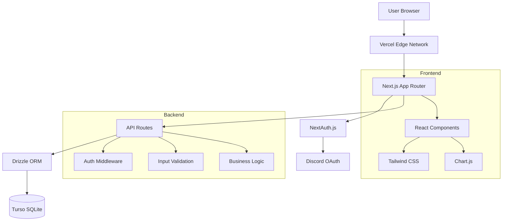

# 🏗️ Architecture Overview

This document provides a high-level overview of Resource Tracker's architecture, technology choices, and design decisions.

## System Architecture



## Technology Stack

### Frontend
- **Framework**: Next.js 14 with App Router
- **UI Library**: React 18 with TypeScript
- **Styling**: Tailwind CSS with dark/light themes
- **Charts**: Chart.js for resource history visualization
- **State Management**: React hooks (no external state library)

### Backend
- **Runtime**: Node.js on Vercel Edge Functions
- **API**: Next.js API Routes with TypeScript
- **Authentication**: NextAuth.js with Discord OAuth
- **Database ORM**: Drizzle ORM with TypeScript
- **Database**: Turso (SQLite) cloud database

### Infrastructure
- **Hosting**: Vercel (Edge Network + Serverless Functions)
- **Database**: Turso (Global SQLite replication)
- **CDN**: Vercel Edge Network (100+ regions)
- **SSL**: Automatic HTTPS with Vercel

## Data Flow

### Authentication Flow
```
1. User clicks "Sign in with Discord"
2. Redirected to Discord OAuth
3. User authorizes application
4. Discord returns authorization code
5. NextAuth exchanges code for access token
6. Fetch user's Discord guild roles
7. Store session with role information
8. Redirect to dashboard
```

### Resource Update Flow
```
1. User submits a resource quantity change for a specific location (Hagga or Deep Desert).
2. Middleware validates the user's authentication session.
3. The API route checks if the user's role has the required permissions.
4. Input data (quantity, location, reason) is validated.
5. The status is recalculated based on the total quantity vs. the target.
6. The appropriate quantity field (`quantityHagga` or `quantityDeepDesert`) is updated in the `resources` table.
7. A detailed record is created in the `resource_history` table, capturing the before-and-after quantities for both locations.
8. Leaderboard points are calculated and stored.
9. The updated resource data is returned to the client.
10. The frontend UI updates optimistically to reflect the new state.
```

### Permission System
```
Role Configuration → Discord Roles → Session Storage → Route Protection

DISCORD_ROLES_CONFIG ──→ User's Discord Roles ──→ JWT Token ──→ API Authorization
                                                      ↓
                                              Middleware Check ──→ Allow/Deny
```

## Component Architecture

### Frontend Components
```
app/
├── layout.tsx              # Root layout with providers
├── page.tsx               # Landing page
├── components/            # Reusable components
│   ├── ClientNavigation.tsx   # Navigation with auth
│   ├── ResourceTable.tsx     # Main resource grid
│   ├── ResourceHistoryChart.tsx  # Time series charts
│   └── ThemeProvider.tsx     # Dark/light theme context
├── dashboard/             # Dashboard pages
└── resources/             # Resource management pages
```

### API Layer
```
app/api/
├── auth/[...nextauth]/    # NextAuth.js handler
├── resources/             # Resource CRUD operations
│   ├── route.ts              # List and create resources
│   ├── [id]/route.ts         # Get, update, delete resource
│   ├── [id]/history/         # Resource change history
│   └── [id]/target/          # Target quantity management
├── users/                 # User management endpoints
│   └── route.ts              # List all users (Admin)
├── user/                  # Endpoints for the authenticated user
│   ├── activity/route.ts     # User's personal activity
│   ├── data-export/route.ts  # GDPR data export for self
│   └── data-deletion/route.ts # GDPR data deletion for self
└── leaderboard/           # Points and rankings
```

## Database Design

### Schema Overview
The schema is designed around five core tables to handle users, resources, and their interactions.
-   **`users`**: Stores essential information about a user, linked to their Discord ID.
-   **`user_sessions`**: Caches user role data from Discord to reduce API calls and speed up authentication checks.
-   **`resources`**: The central table for all trackable items. Crucially, it tracks quantities separately for two locations: `quantityHagga` and `quantityDeepDesert`.
-   **`resource_history`**: Provides a detailed, immutable audit trail. Every change is recorded here, including the before-and-after quantities for *both* locations to ensure complete traceability, even for transfers.
-   **`leaderboard`**: Stores records of user contributions and calculated points for the gamification system.

### Key Relationships
- **Users → Resources**: Through `resource_history.updated_by`
- **Resources → History**: One-to-many relationship
- **Users → Leaderboard**: Points calculated from history
- **Resources → Status**: Calculated from total quantity vs. target

This architecture provides a solid foundation for a secure, scalable, and maintainable resource management system while remaining flexible enough for diverse organizational needs.